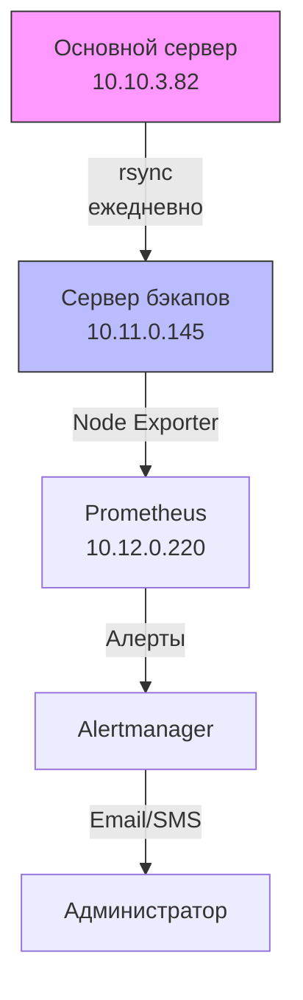

# Система резервного копирования (СРК)

## 1. Общая информация
- **Сервер бэкапов**: 10.11.0.145 (Ubuntu 22.04)
- **Тип бэкапов**: 
  - Полные (еженедельно)
  - Инкрементные (ежедневно)
- **Хранилище**: `/opt/backups/{daily,weekly,monthly}`
- **Мониторинг**: Prometheus + Alertmanager

## 2. Сценарии отказа и восстановления

| Сценарий                     			| Действия по восстановлению                                                                 | Критичность |
|-----------------------------------------------|--------------------------------------------------------------------------------------------|-------------|
| **1. Потеря данных на основном сервере** 	| 1. Определить дату последнего валидного бэкапа<br>2. Выполнить: `tar -xzf /opt/backups/weekly/backup_YYYY-MM-DD.tar.gz -C /` | Критическая |
| **2. Отказ сервера бэкапов** 			| 1. Развернуть новый сервер из образа<br>2. Восстановить конфиги из Git<br>3. Перезапустить cron-задачи | Высокая     |
| **3. Нехватка места на диске** 		| 1. Очистить старые бэкапы: `find /opt/backups -type f -name "*.tar.gz" -mtime +30 -delete`<br>2. Расширить диск | Средняя     |
| **4. Компрометация сервера** 			| 1. Изолировать сервер<br>2. Проверить целостность бэкапов<br>3. Развернуть чистый сервер | Критическая |
| **5. Повреждение бэкапа**    			| 1. Проверить альтернативные копии<br>2. Использовать `tar -tf backup_FILE.tar.gz` для проверки<br>3. Восстановить вручную ключевые файлы | Высокая     |

## 3. Инструкции

### Восстановление данных
```bash
# Для полного бэкапа
tar -xzf /opt/backups/weekly/backup_2023-11-20.tar.gz -C /restore/path
```
> Подставьте имя согласно необходимой дате бэкапа!
```bash
# Для проверки содержимого
tar -tf /opt/backups/daily/backup_2023-11-25.tar.gz
```
> Подставьте имя согласно необходимой дате бэкапа!
## 4. Архитектура СРК
Первоначальная схема архитектуры СРК представлена ниже:
> **Важно!**
> Схема будет дополняться и меняться в зависимости от изменений компании.

