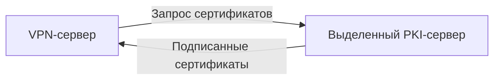

---

# **План развития инфраструктуры**  
*(на следующее полугодие)*  

### **Текущее состояние**  
| Компонент           | Сервер          | Описание                  |  
|---------------------|----------------|---------------------------|  
| VPN + PKI           | 10.10.3.82     | Объединённые сервисы      |  
| Мониторинг          | 10.12.0.220    | Prometheus + Alertmanager |  
| Резервное копирование | 10.11.0.145   | Rsync + локальное хранилище |  

---

### **1. Разделение VPN и PKI**  
**Проблема**: Риск компрометации корневого CA при атаке на VPN.  
**Решение**:  

**Задачи**:  
1. Развернуть новый сервер для PKI (10.10.3.83)  
2. Перенести Easy-RSA с шифрованием диска (LUKS)  
3. Настроить доступ только по внутренней сети  

**Срок**: 2 недели  

---

### **2. Переход на Infrastructure as Code**  
**Проблема**: Ручное управление конфигурациями.  
**Решение**:  
```bash
terraform {
  required_providers {
    proxmox = {
      source = "telmate/proxmox"
    }
  }
}

resource "proxmox_vm_qemu" "vpn_server" {
  name        = "vpn-prod"
  target_node = "pve01"
  clone       = "ubuntu-2204-template"
  ipconfig0   = "ip=10.10.3.82/24,gw=10.10.3.1"
}
```  
**Задачи**:  
1. Написать Terraform-конфиги для всех серверов  
2. Автоматизировать развёртывание Ansible-плейбуками  
3. Интегрировать с GitLab CI/CD  

**Срок**: 4 недели  

---

### **3. Улучшение системы бэкапов**  
**Проблема**: Нет гео-избыточности.  
**Решение**:  
```mermaid
graph TB
  A[Сервисы] -->|BorgBackup| B[Локальный сервер]  
  B -->|Rclone| C[Облако (S3)]  
  B -->|Зашифрованные tapes| D[Автономное хранилище]  
```  
**Задачи**:  
1. Внедрить BorgBackup с дедупликацией  
2. Настроить копирование в Wasabi (S3-совместимое)  
3. Реализовать ежеквартальные бэкапы на LTO-ленты  

**Срок**: 4 недели  

---

### **4. Мониторинг и алертинг**  
**Проблема**: Нет SLA по времени реакции.  
**Улучшения**:  
| Метрика               | Порог          | Канал оповещения |  
|-----------------------|---------------|------------------|  
| Доступность VPN       | <99.9% за сутки | Telegram + PagerDuty |  
| Срок действия CA      | <30 дней      | Email             |  
| Место на бэкапах      | <10% свободно | SMS               |  

**Задачи**:  
1. Настроить эскалацию алертов в Alertmanager  
2. Добавить дашборды в Grafana с SLA-виджетами  

**Срок**: 4 недели  

---

### **5. План развития (Roadmap)**  
| Что делаем            | Цель                                         | Срок       | Приоритет |  
|-----------------------|---------------------------------------------|------------|-----------|  
| Выделенный PKI        | Изолировать корневые ключи                  | 2025-Q3    | High      |  
| Terraform + Ansible   | Уменьшить время развёртывания               | 2025-Q3    | Critical  |  
| Гео-бэкапы           | Соответствие RPO=15 мин, RTO=1 час          | 2025-Q4   | Medium    |  
| Мониторинг SLA        | Гарантировать 99.95% uptime VPN             | 2025-Q4    | High      |  

---

